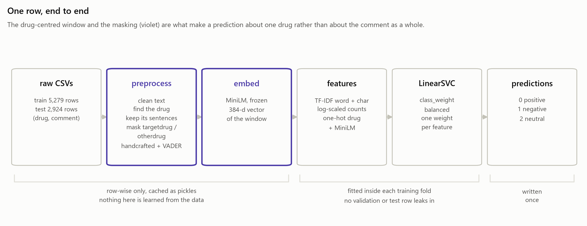

# Drug Sentiment Analysis

Analytics Vidhya Blackbelt capstone: predict the sentiment of a patient comment **toward a specific drug**
(0 = positive, 1 = negative, 2 = neutral). Metric: weighted F1.

A comment can mention several drugs and praise one while blaming another, so the label belongs to the
*(comment, drug)* pair rather than to the text. Every design decision here follows from that: the model reads a
window of sentences around the drug the row asks about, with the drug names masked (`targetdrug` / `otherdrug`).



## Setup

```bash
uv sync
```

Place the competition files in `Data/raw/`:
`train_F3WbcTw_1icmK82.csv`, `test_tOlRoBf_VeRQtHl.csv`, `sample_submission_Wy5x1QK.csv`.

## Pipeline stages

| Stage | Command | Output |
|---|---|---|
| Ingest & validate | `uv run python main.py ingest` | log of record counts and validation checks |
| Preprocess | `uv run python main.py preprocess` | `artifacts/preprocessed/` train and test pkl files, drug lexicon |
| Embed | `uv run python main.py embed` | `artifacts/preprocessed/embeddings/` MiniLM sentence-embedding pkl files |
| Train | `uv run python main.py train` | `artifacts/model/best_model.pkl` and `model_card.json` |
| Evaluate | `uv run python main.py evaluate` | out-of-fold report, error analysis and ablation tables in `artifacts/reports/` |
| Predict | `uv run python main.py predict` | `artifacts/submission/predictions.csv`, checked against the sample submission |
| Slides | `uv run python main.py slides` | `presentation/Drug_Sentiment_Capstone.pptx` |
| Package | `uv run python main.py package` | `submission/Drug_Sentiment_Capstone_submission.zip` |

`uv run python main.py all` runs ingest → preprocess → embed → train → evaluate → predict; the deck and the zip are
built on demand afterwards. Run the tests with `uv run pytest`.

Scoring text that is not in the CSVs:

```bash
uv run python -m drug_sentiment.inference.predict --drug Humira --text "Humira cleared my psoriasis in weeks."
uv run python -m drug_sentiment.inference.predict --csv comments.csv --out scored.csv
```

## How a row becomes model input

1. **Clean** the comment (HTML, URLs — keeping the words in the path, encoding junk, contractions).
2. **Find the drug** with a lexicon of the training drug names plus `config/drug_synonyms.yaml`, and rapidfuzz for
   misspellings (`stellara` → `stelara`).
3. **Window**: keep the sentences that mention the drug, plus one on each side, capped at 250 words.
4. **Mask**: the row's drug becomes `targetdrug`, every other known drug `otherdrug`.
5. **Features**: mention count and position, other drugs, lengths, negations, first-person words, VADER scores.
6. **Embed** the unmasked window with frozen MiniLM (384-d).

Steps 1–6 are row-wise — nothing is fitted on the data — so they are cached as pickles and reused by every model and
every fold. Everything that *is* fitted (TF-IDF, SVD, scalers, the drug encoder) lives inside the model pipeline and
is therefore fitted on training folds only. `test.csv` is read once, by the predict stage.

## Exploratory analysis

[`NoteBook/01_EDA.ipynb`](NoteBook/01_EDA.ipynb) explores the data and records the modelling decision each finding
leads to. Its 9 figures are saved to `artifacts/reports/figures/` for the presentation.

## Model selection

[`NoteBook/model_expriments.ipynb`](NoteBook/model_expriments.ipynb) trains 10 classical models (logistic
regression, linear and RBF SVMs, complement naive Bayes, KNN, decision tree, random forest, gradient boosting,
LightGBM, XGBoost) on half of `train.csv`, tunes the top 3 with Optuna on the full training data using 5-fold
cross-validation, and saves the winner to `artifacts/model/best_model_config.json`. That file makes it the project's
main model: the `train`, `evaluate` and `predict` stages read it. Screening and tuning tables are in
`artifacts/reports/`.

## Results

The main model is a tuned **LinearSVC** (`C = 0.085`, `class_weight="balanced"`) on 68,475 sparse features built
from the drug window. All scores below are out of fold on the 5,279 training rows, over the 5 stored folds.

| | Weighted F1 | Macro F1 | Accuracy |
|---|---|---|---|
| Always predict neutral | 0.609 | 0.280 | 0.725 |
| Best of the other nine screened models (XGBoost) | 0.715 | 0.524 | - |
| **LinearSVC — shipped** | **0.727** | **0.572** | **0.732** |

Spread across the 5 folds: 0.004 weighted F1, so the ranking is not fold noise. Fitting the final model on all
5,279 rows takes 17 seconds on a laptop CPU.

Predicted mix on `test.csv`: 76.7% neutral, 14.4% negative, 8.8% positive (training mix: 72.5 / 15.9 / 11.7).

## Deliverables

| File | What it is |
|---|---|
| [`Drug_Sentiment_Capstone.ipynb`](Drug_Sentiment_Capstone.ipynb) | the end-to-end notebook: data → decisions → results → submission |
| `presentation/Drug_Sentiment_Capstone.pptx` | the 15-slide deck, built from the artifacts by `main.py slides` |
| `artifacts/submission/predictions.csv` | 2,924 test predictions in the sample-submission format |
| [`docs/viva_prep.md`](docs/viva_prep.md) | every design decision, the concepts behind it, and the likely questions |

## Project layout

```
config/config.yaml        paths and pipeline settings
src/drug_sentiment/       package: data, preprocessing, features, models, inference, reporting, visualization
main.py                   stage runner
tests/                    pytest suite
artifacts/                preprocessed pkl files, model, reports, figures, submission
NoteBook/                 exploration and experiment notebooks
```

## Data note

The brief quotes 5,619 train / 3,107 test rows. Those are physical line counts: some comments contain line
breaks inside a quoted CSV field. The files hold **5,279** and **2,924** records, and `sample_submission`
has 2,924 ids in test order, so the submission has 2,924 rows.
